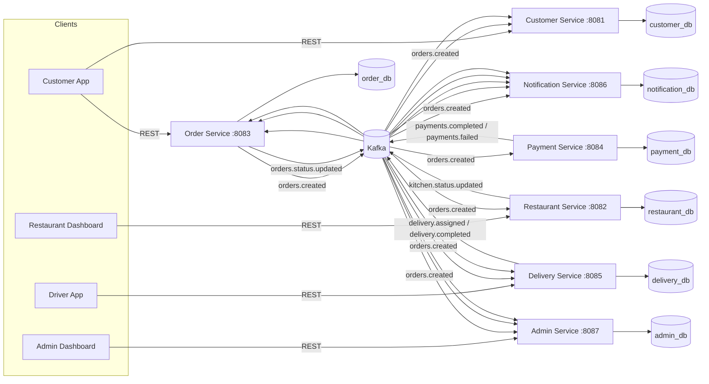

# Distributed Food Delivery Platform

**DSA612S — Distributed Systems and Applications, Assignment 2**
NUST | Faculty of Computing and Informatics | Department of Software Engineering

A microservices-based food delivery platform built in **Ballerina Swan Lake**, coordinated
asynchronously over **Apache Kafka**, persisted in **MySQL** (one database per service), and
orchestrated with **Docker Compose**.

---

## 1. Architecture



### Order lifecycle state machine (owned exclusively by the Order Service)

```
CREATED -> CONFIRMED -> PREPARING -> READY -> OUT_FOR_DELIVERY -> DELIVERED
   \-> CANCELLED (from CREATED, CONFIRMED, PREPARING or READY)
```

Only the **Order Service** writes `orders.status`. Every other service communicates a change to
that state purely by publishing a Kafka event; the Order Service is the single consumer that
applies the transition and re-publishes a generic `orders.status.updated` event that the
Customer, Notification and Admin services subscribe to. This avoids synchronous
service-to-service coupling and keeps the state machine consistent.

### Kafka topics

| Topic                     | Producer             | Consumers                                          |
|---------------------------|----------------------|-----------------------------------------------------|
| `orders.created`          | Order Service         | Restaurant, Payment, Delivery, Notification, Admin, Customer |
| `orders.status.updated`   | Order Service         | Customer, Notification, Admin                        |
| `payments.completed`      | Payment Service        | Order, Notification                                  |
| `payments.failed`         | Payment Service        | Order, Notification                                  |
| `kitchen.status.updated`  | Restaurant Service     | Order, Delivery                                      |
| `delivery.assigned`       | Delivery Service       | Order, Notification, Admin                           |
| `delivery.completed`      | Delivery Service       | Order, Notification, Admin                           |

All topics are created with **3 partitions** (see `kafka-topics-init` in `docker-compose.yml`),
keyed by `orderId` so that all events for a given order land on the same partition and are
processed in order by any single consumer instance.

### Why event-driven, and where REST still fits

REST is used for **synchronous, client-facing** operations (placing an order, browsing a menu,
a driver confirming a hand-off). Kafka is used for **asynchronous, cross-service coordination**
(payment result, kitchen status, driver assignment) so that a slow or temporarily unavailable
downstream service (e.g. Notification) can never block or fail an upstream one (e.g. Order
creation) — this is what gives the platform the fault-tolerance the brief calls for.

---

## 2. Services

| # | Service               | Port | Responsibility                                              |
|---|------------------------|------|---------------------------------------------------------------|
| 1 | Customer Service       | 8081 | Accounts, addresses, order-history read model                 |
| 2 | Restaurant Service     | 8082 | Menus, inventory, kitchen opening hours & prep status          |
| 3 | Order Service          | 8083 | Central order state machine                                    |
| 4 | Payment Service        | 8084 | Simulated payment processing                                    |
| 5 | Delivery Service       | 8085 | Driver registry, assignment, delivery tracking                  |
| 6 | Notification Service   | 8086 | Multi-channel (simulated) alerts to all three actor types        |
| 7 | Admin Service          | 8087 | Event-sourced reporting (CQRS read model) on restaurants/drivers |

Each service is its own Ballerina package (`Ballerina.toml`), owns its own MySQL database, and
is independently containerised (`Dockerfile`).

---

## 3. Project layout

```
food-delivery-platform/
├── docker-compose.yml
├── init-db/                     # one .sql file per service database, auto-run by the mysql container
├── customer-service/
│   ├── Ballerina.toml
│   ├── Config.toml               # local-dev defaults (overridden by env vars in Docker)
│   ├── types.bal                 # domain + Kafka event record types
│   ├── db.bal                    # MySQL client
│   ├── kafka_consumer.bal        # (producer.bal too, where relevant)
│   ├── service.bal               # HTTP REST API
│   └── Dockerfile
├── restaurant-service/  ...same shape...
├── order-service/       ...
├── payment-service/     ...
├── delivery-service/    ...
├── notification-service/...
└── admin-service/       ...
```

---

## 4. Running it

### Prerequisites
* Docker + Docker Compose v2
* (Only if you want to run a service outside Docker for development) [Ballerina Swan Lake](https://ballerina.io/downloads/) 2201.10.0 or later — check `bal version` and adjust the `FROM ballerina/ballerina:...` tag in each `Dockerfile` to match if you're on a different distribution.

### Start everything

```bash
cd food-delivery-platform
docker compose up --build
```

This will, in order:
1. Start Zookeeper + Kafka.
2. Run `kafka-topics-init` to create all 7 topics (3 partitions each).
3. Start MySQL and load the schema + seed data for all 7 databases from `init-db/`.
4. Build and start all 7 Ballerina microservices, each waiting on Kafka + MySQL to be healthy.

Check everything is up:

```bash
curl http://localhost:8081/customers/health
curl http://localhost:8082/restaurants/health
curl http://localhost:8083/orders/health
curl http://localhost:8084/payments/health
curl http://localhost:8085/delivery/health
curl http://localhost:8086/notifications/health
curl http://localhost:8087/admin/health
```

### Tear down

```bash
docker compose down -v   # -v also drops the mysql-data volume
```

---

## 5. Walking through the whole order lifecycle (curl)

Seed data already includes one customer, one restaurant with a menu, and two drivers
(see `init-db/`). IDs below match those seeds — substitute your own if you created new records.

```bash
# 1. Place an order (Order Service publishes orders.created)
curl -s -X POST http://localhost:8083/orders \
  -H "Content-Type: application/json" \
  -d '{
    "customerId": "c1111111-1111-1111-1111-111111111111",
    "restaurantId": "r1111111-1111-1111-1111-111111111111",
    "items": [
      {"itemId": "m1111111-1111-1111-1111-111111111111", "name": "Chicken Burger", "quantity": 2, "price": 65.00},
      {"itemId": "m3333333-3333-3333-3333-333333333333", "name": "Iced Coffee", "quantity": 1, "price": 25.00}
    ]
  }'
# => {"id": "<orderId>", "status": "CREATED", "totalAmount": 155.00, ...}

# 2. Payment Service auto-processes the payment within a second or two
curl -s http://localhost:8084/payments/<orderId>

# 3. Order should now be CONFIRMED
curl -s http://localhost:8083/orders/<orderId>

# 4. Kitchen marks the order as being prepared, then ready
curl -s -X PUT http://localhost:8082/restaurants/r1111111-1111-1111-1111-111111111111/orders/<orderId>/status \
  -H "Content-Type: application/json" -d '{"status": "PREPARING"}'

curl -s -X PUT http://localhost:8082/restaurants/r1111111-1111-1111-1111-111111111111/orders/<orderId>/status \
  -H "Content-Type: application/json" -d '{"status": "READY"}'

# 5. Delivery Service auto-assigns an available driver -> order becomes OUT_FOR_DELIVERY
curl -s http://localhost:8085/delivery/deliveries/<orderId>
curl -s http://localhost:8083/orders/<orderId>

# 6. Driver marks pickup, then delivery -> order becomes DELIVERED
curl -s -X PUT http://localhost:8085/delivery/deliveries/<orderId>/status \
  -H "Content-Type: application/json" -d '{"status": "PICKED_UP"}'

curl -s -X PUT http://localhost:8085/delivery/deliveries/<orderId>/status \
  -H "Content-Type: application/json" -d '{"status": "DELIVERED"}'

curl -s http://localhost:8083/orders/<orderId>
# => {"status": "DELIVERED", ...}

# 7. Inspect what happened along the way
curl -s "http://localhost:8086/notifications?orderId=<orderId>"     # every alert that was fired
curl -s http://localhost:8081/customers/c1111111-1111-1111-1111-111111111111/orders  # customer's history
curl -s http://localhost:8087/admin/reports/summary                 # aggregated platform stats
```

---

## 6. Mapping to the marking rubric

| Criterion                                             | Where to find it |
|--------------------------------------------------------|-------------------|
| Kafka setup & topic management (15%)                    | `docker-compose.yml` (`kafka-topics-init`, 3 partitions/topic), `kafka_producer.bal` / `kafka_consumer.bal` in every service |
| Database setup & schema design (10%)                     | `init-db/*.sql` — one schema per service, seeded, FK constraints where relevant |
| Microservices implementation (Ballerina) (50%)            | 7 independent Ballerina packages, REST APIs, order state machine (`order-service/order_repository.bal`) |
| Docker configuration & orchestration (20%)                | `Dockerfile` per service (multi-stage `bal build` -> JRE runtime), single `docker-compose.yml` |
| Documentation & presentation (5%)                          | This README, architecture + sequence diagrams, curl walkthrough |
| Bonus: driver location simulation                          | `PUT /delivery/drivers/{id}/location` — hook a simple script/loop to it to simulate live GPS |

---

## 7. Notes, assumptions & things to extend

* **Payment simulation**: the Payment Service always succeeds unless the order total is `<= 0`.
  Swap `kafka_consumer.bal` in `payment-service` for a random-failure model if you want to
  demo the `CANCELLED` path more often for the defence.
* **Single MySQL instance, multiple databases**: this keeps the compose file light for a student
  assignment while still giving each service its own schema/credentials boundary
  (database-per-service). For a "harder" distributed-systems story you could split each into
  its own container — the code doesn't need to change, only `BAL_DBHOST` per service.
* **Config overrides**: every configurable value (`dbHost`, `kafkaBootstrap`, `servicePort`, ...)
  can be overridden at runtime via `BAL_<NAME_UPPERCASED>` environment variables (see
  `docker-compose.yml`) without touching code — this is how the same source compiles both for
  local `bal run` (using `Config.toml` defaults) and for the containerised network.
* **Bonus ideas left as extension points**: route optimisation (Delivery Service, using the
  `current_lat`/`current_lng` columns already on `drivers`), surge pricing (Order Service, based
  on the ratio of `OUT_FOR_DELIVERY` orders to `AVAILABLE` drivers), and a Prometheus/Grafana
  stack (add `ballerina/observe` + a `prometheus`/`grafana` service to `docker-compose.yml`).

---

## 8. Academic integrity

This scaffold was produced with AI assistance as a **guide**, per the assignment's own policy
("AI tools should only be used as a guide"). Before submission, your group should:
1. Actually run `docker compose up --build` and fix any compile errors against the exact
   Ballerina Swan Lake version your lab machines have installed (`bal version`).
2. Read through and understand every service — you will be asked to defend it live.
3. Make sure every group member commits real code under their own GitHub username; the brief
   is explicit that non-contributors (by commit log) get 0.
4. Extend/adjust the design decisions above where your group prefers a different approach —
   this is a starting point, not a final answer.
